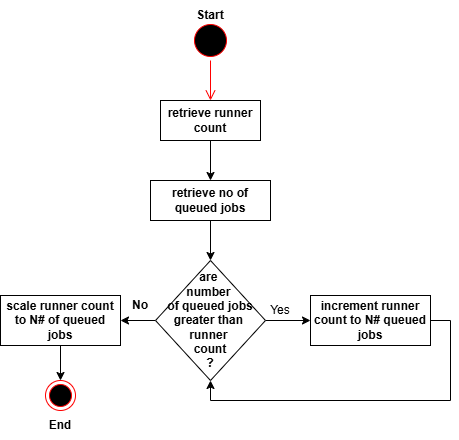

# Overview
The script automates the deployment and scaling of github runners in AWS based on the following flow:

## Resource Created
- AWS VPC
- AWS Subnets and Route Table
- AWS AutoScaling Group
- EC2 instance
- Launch Template
- IAM Role

## Deployment Steps

### Required Environment variables
- SECRET_REGION= "infrastructure  region"
- AUTO_SCALING_MAX= "default scaling size of runners"
- AUTO_SCALING_GROUP_NAME= "name of autoscaling group"
- AUTO_SCALING_GROUP_REGION= "auto scaling group  region"
- GITHUB_OWNER= "github owner i.e username or organisation name"
- REPOSITORY_NAME= "repository name"
- GITHUB_OWNER_TYPE= "repository owner type, is it organisation (represented by "org")  or user (represented by "user")"
- GITHUB_AUTH_TOKEN= "github token"

### Deployment Commands

- cdk bootstrap
- cdk deploy 